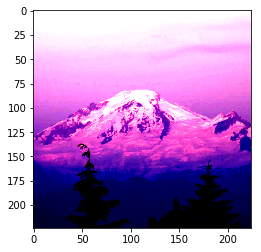

## Configuration

Install GluonCV through `pip`


```python
!pip install gluoncv
```

    Requirement already satisfied: gluoncv in /home/ec2-user/anaconda3/envs/mxnet_p36/lib/python3.6/site-packages (0.3.0)
    Requirement already satisfied: tqdm in /home/ec2-user/anaconda3/envs/mxnet_p36/lib/python3.6/site-packages (from gluoncv) (4.28.1)
    Requirement already satisfied: scipy in /home/ec2-user/anaconda3/envs/mxnet_p36/lib/python3.6/site-packages (from gluoncv) (1.1.0)
    Requirement already satisfied: requests in /home/ec2-user/anaconda3/envs/mxnet_p36/lib/python3.6/site-packages (from gluoncv) (2.20.1)
    Requirement already satisfied: numpy in /home/ec2-user/anaconda3/envs/mxnet_p36/lib/python3.6/site-packages (from gluoncv) (1.14.5)
    Requirement already satisfied: Pillow in /home/ec2-user/anaconda3/envs/mxnet_p36/lib/python3.6/site-packages (from gluoncv) (5.0.0)
    Requirement already satisfied: matplotlib in /home/ec2-user/anaconda3/envs/mxnet_p36/lib/python3.6/site-packages (from gluoncv) (2.2.2)
    Requirement already satisfied: chardet<3.1.0,>=3.0.2 in /home/ec2-user/anaconda3/envs/mxnet_p36/lib/python3.6/site-packages (from requests->gluoncv) (3.0.4)
    Requirement already satisfied: idna<2.8,>=2.5 in /home/ec2-user/anaconda3/envs/mxnet_p36/lib/python3.6/site-packages (from requests->gluoncv) (2.6)
    Requirement already satisfied: urllib3<1.25,>=1.21.1 in /home/ec2-user/anaconda3/envs/mxnet_p36/lib/python3.6/site-packages (from requests->gluoncv) (1.22)
    Requirement already satisfied: certifi>=2017.4.17 in /home/ec2-user/anaconda3/envs/mxnet_p36/lib/python3.6/site-packages (from requests->gluoncv) (2018.8.24)
    Requirement already satisfied: cycler>=0.10 in /home/ec2-user/anaconda3/envs/mxnet_p36/lib/python3.6/site-packages (from matplotlib->gluoncv) (0.10.0)
    Requirement already satisfied: pyparsing!=2.0.4,!=2.1.2,!=2.1.6,>=2.0.1 in /home/ec2-user/anaconda3/envs/mxnet_p36/lib/python3.6/site-packages (from matplotlib->gluoncv) (2.2.0)
    Requirement already satisfied: python-dateutil>=2.1 in /home/ec2-user/anaconda3/envs/mxnet_p36/lib/python3.6/site-packages (from matplotlib->gluoncv) (2.7.3)
    Requirement already satisfied: pytz in /home/ec2-user/anaconda3/envs/mxnet_p36/lib/python3.6/site-packages (from matplotlib->gluoncv) (2018.4)
    Requirement already satisfied: six>=1.10 in /home/ec2-user/anaconda3/envs/mxnet_p36/lib/python3.6/site-packages (from matplotlib->gluoncv) (1.11.0)
    Requirement already satisfied: kiwisolver>=1.0.1 in /home/ec2-user/anaconda3/envs/mxnet_p36/lib/python3.6/site-packages (from matplotlib->gluoncv) (1.0.1)
    Requirement already satisfied: setuptools in /home/ec2-user/anaconda3/envs/mxnet_p36/lib/python3.6/site-packages (from kiwisolver>=1.0.1->matplotlib->gluoncv) (39.1.0)
    mxnet-model-server 0.4 requires mxnet-mkl>=1.2, which is not installed.
    mxnet-model-server 0.4 has requirement onnx==1.1.1, but you'll have onnx 1.2.1 which is incompatible.
    mxnet-cu90mkl 1.3.0.post0 has requirement requests<2.19.0,>=2.18.4, but you'll have requests 2.20.1 which is incompatible.
    keras 2.2.2 has requirement keras-preprocessing==1.0.2, but you'll have keras-preprocessing 1.0.1 which is incompatible.
    You are using pip version 10.0.1, however version 18.1 is available.
    You should consider upgrading via the 'pip install --upgrade pip' command.


Import necessary modules


```python
import os, time, shutil, zipfile
import matplotlib.pyplot as plt
import numpy as np

import mxnet as mx
from mxnet import gluon, image, init, nd
from mxnet import autograd as ag
from mxnet.gluon import nn
from mxnet.gluon.data.vision import transforms

import gluoncv
from gluoncv.utils import makedirs, download
from gluoncv.model_zoo import get_model
```

## Predict with Pre-trained Models

Let's load an image first.


```python
download('https://raw.githubusercontent.com/dmlc/web-data/master/gluoncv/classification/mt_baker.jpg', path='./')
filename = 'mt_baker.jpg'
img = mx.image.imread(filename)
plt.imshow(img.asnumpy())
```


    <matplotlib.image.AxesImage at 0x7f7f35fb0f28>


Choose a good model, load pre-trained weights with `pretrained=True`.


```python
model_name = 'ResNet50_v1'
net = gluoncv.model_zoo.get_model(model_name, pretrained=True)
```

Preprocess the image with the preset transformations.


```python
transformed_img = gluoncv.data.transforms.presets.imagenet.transform_eval(img)
```

How does the transformed image look like?


```python
import numpy as np
plt.imshow(np.transpose(transformed_img[0].asnumpy(), (1, 2, 0)))
```

    Clipping input data to the valid range for imshow with RGB data ([0..1] for floats or [0..255] for integers).


    <matplotlib.image.AxesImage at 0x7f7f359da9e8>





The transformation does the following two things:

1. Crop the center square
2. Normalizes the input image

With this, we can predict with one line of code:


```python
pred = net(transformed_img)
```

Check the top-5 predicted classes.


```python
prob = mx.nd.softmax(pred)[0].asnumpy()
ind = mx.nd.topk(pred, k=5)[0].astype('int').asnumpy().tolist()
print('The input picture is classified to be')
for i in range(5):
    print('- [%s], with probability %.3f.'%(net.classes[ind[i]], prob[ind[i]]))
```

    The input picture is classified to be
    - [volcano], with probability 0.653.
    - [alp], with probability 0.132.
    - [mountain tent], with probability 0.013.
    - [valley], with probability 0.010.
    - [lakeside], with probability 0.006.


We see the model gives the correct result. How about a smaller one?

You only need to change the name of the model from the above code.


```python
model_name = 'MobileNet0.25'
net = gluoncv.model_zoo.get_model(model_name, pretrained=True)
pred = net(transformed_img)
prob = mx.nd.softmax(pred)[0].asnumpy()
ind = mx.nd.topk(pred, k=5)[0].astype('int').asnumpy().tolist()
print('The input picture is classified to be')
for i in range(5):
    print('- [%s], with probability %.3f.'%(net.classes[ind[i]], prob[ind[i]]))
```

    The input picture is classified to be
    - [volcano], with probability 0.178.
    - [alp], with probability 0.166.
    - [lakeside], with probability 0.048.
    - [valley], with probability 0.035.
    - [mountain tent], with probability 0.025.


The smaller model is not that confident, but still gives a good enough prediction.

## Transfer Learning with your own data

Now we are going to demonstrate how to transfer the knowledge from pre-trained model to your own domain.

We use a sampled smaller dataset in this tutorial. Introduction to the entire dataset can be found at [this page](https://gluon-cv.mxnet.io/build/examples_classification/transfer_learning_minc.html#data-preparation).


```python
file_url = 'https://raw.githubusercontent.com/dmlc/web-data/master/gluoncv/classification/minc-2500-tiny.zip'
zip_file = download(file_url, path='./')
with zipfile.ZipFile(zip_file, 'r') as zin:
    zin.extractall(os.path.expanduser('./'))
```

Next we prepare the hyperparameters.


```python
classes = 23

epochs = 5
lr = 0.001
per_device_batch_size = 1
momentum = 0.9
wd = 0.0001

lr_factor = 0.75
lr_steps = [10, 20, 30, np.inf]

num_gpus = 1
num_workers = 8
ctx = [mx.gpu(i) for i in range(num_gpus)] if num_gpus > 0 else [mx.cpu()]
batch_size = per_device_batch_size * max(num_gpus, 1)
```

Next, transformation, which is the preprocessing.
We implement the same preprocessing function as ImageNet.

Note: keep the transformation consistent with the original model training is important in transfer learning.


```python
jitter_param = 0.4
lighting_param = 0.1

transform_train = transforms.Compose([
    transforms.RandomResizedCrop(224),
    transforms.RandomFlipLeftRight(),
    transforms.RandomColorJitter(brightness=jitter_param, contrast=jitter_param,
                                 saturation=jitter_param),
    transforms.RandomLighting(lighting_param),
    transforms.ToTensor(),
    transforms.Normalize([0.485, 0.456, 0.406], [0.229, 0.224, 0.225])
])

transform_test = transforms.Compose([
    transforms.Resize(256, keep_ratio=True),
    transforms.CenterCrop(224),
    transforms.ToTensor(),
    transforms.Normalize([0.485, 0.456, 0.406], [0.229, 0.224, 0.225])
])
```

Now we can load the data into train, validation, and test.

For validation and test, we use the same transformation.


```python
path = './minc-2500-tiny'
train_path = os.path.join(path, 'train')
val_path = os.path.join(path, 'val')
test_path = os.path.join(path, 'test')

train_data = gluon.data.DataLoader(
    gluon.data.vision.ImageFolderDataset(train_path).transform_first(transform_train),
    batch_size=batch_size, shuffle=True, num_workers=num_workers)

val_data = gluon.data.DataLoader(
    gluon.data.vision.ImageFolderDataset(val_path).transform_first(transform_test),
    batch_size=batch_size, shuffle=False, num_workers = num_workers)

test_data = gluon.data.DataLoader(
    gluon.data.vision.ImageFolderDataset(test_path).transform_first(transform_test),
    batch_size=batch_size, shuffle=False, num_workers = num_workers)
```

Now the data is prepared. We define the model, then 


```python
model_name = 'MobileNet1.0'
finetune_net = get_model(model_name, pretrained=True)
with finetune_net.name_scope():
    finetune_net.output = nn.Dense(classes)
finetune_net.output.initialize(init.Xavier(), ctx = ctx)
finetune_net.collect_params().reset_ctx(ctx)
finetune_net.hybridize()

# Trainer, metric, loss
trainer = gluon.Trainer(finetune_net.collect_params(), 'sgd', {
                        'learning_rate': lr, 'momentum': momentum, 'wd': wd})
metric = mx.metric.Accuracy()
L = gluon.loss.SoftmaxCrossEntropyLoss()
```

Next, a function to measure the performance on validation and test dataset.


```python
def test(net, val_data, ctx):
    metric = mx.metric.Accuracy()
    for i, batch in enumerate(val_data):
        data = gluon.utils.split_and_load(batch[0], ctx_list=ctx, batch_axis=0, even_split=False)
        label = gluon.utils.split_and_load(batch[1], ctx_list=ctx, batch_axis=0, even_split=False)
        outputs = [net(X) for X in data]
        metric.update(label, outputs)

    return metric.get()
```

Finally we can start our training! 


```python
lr_counter = 0
num_batch = len(train_data)

for epoch in range(epochs):
    if epoch == lr_steps[lr_counter]:
        trainer.set_learning_rate(trainer.learning_rate*lr_factor)
        lr_counter += 1

    tic = time.time()
    train_loss = 0
    metric.reset()

    for i, batch in enumerate(train_data):
        data = gluon.utils.split_and_load(batch[0], ctx_list=ctx, batch_axis=0, even_split=False)
        label = gluon.utils.split_and_load(batch[1], ctx_list=ctx, batch_axis=0, even_split=False)
        with ag.record():
            outputs = [finetune_net(X) for X in data]
            loss = [L(yhat, y) for yhat, y in zip(outputs, label)]
        for l in loss:
            l.backward()

        trainer.step(batch_size)
        train_loss += sum([l.mean().asscalar() for l in loss]) / len(loss)

        metric.update(label, outputs)

    _, train_acc = metric.get()
    train_loss /= num_batch

    _, val_acc = test(finetune_net, val_data, ctx)

    print('[Epoch %d] Train-acc: %.3f, loss: %.3f | Val-acc: %.3f | time: %.1f' %
             (epoch, train_acc, train_loss, val_acc, time.time() - tic))

_, test_acc = test(finetune_net, test_data, ctx)
print('[Finished] Test-acc: %.3f' % (test_acc))
```

    [Epoch 0] Train-acc: 0.026, loss: 3.459 | Val-acc: 0.087 | time: 4.2
    [Epoch 1] Train-acc: 0.026, loss: 3.387 | Val-acc: 0.043 | time: 2.4
    [Epoch 2] Train-acc: 0.035, loss: 3.257 | Val-acc: 0.043 | time: 2.4
    [Epoch 3] Train-acc: 0.035, loss: 3.212 | Val-acc: 0.043 | time: 3.0
    [Epoch 4] Train-acc: 0.052, loss: 3.117 | Val-acc: 0.022 | time: 2.5
    [Finished] Test-acc: 0.022


Although this is a small example, it is basically how we train a model on much larger dataset.

## Further resources

On the GluonCV Classification Model Zoo page, we provide:

- Training scripts for ImageNet and CIFAR10.
- Training hyperparameters to reproduce.
- Training Logs to compare speed and accuracy.
